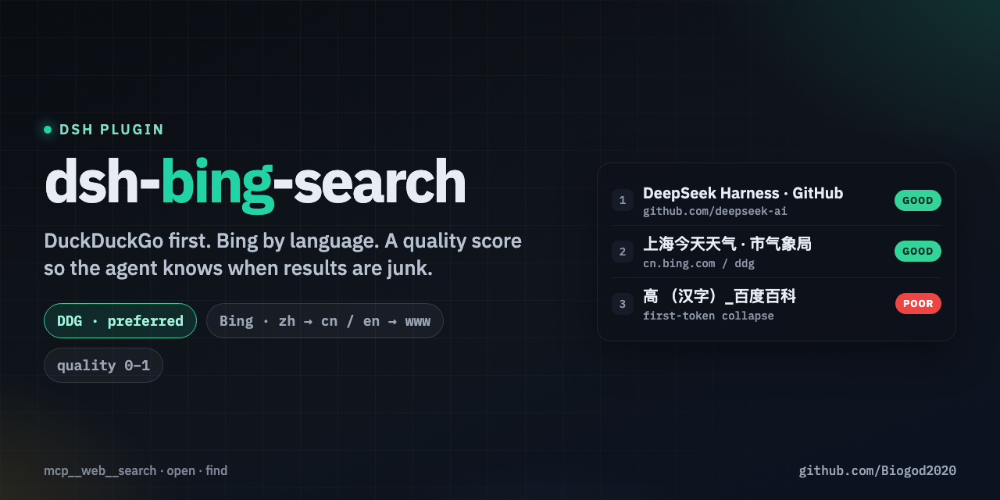

# dsh-bing-search

[简体中文](./README.zh-CN.md)

<p align="center">
  
</p>

Web search for **DeepSeek Harness (DSH)**, implemented as a small MCP server and powered by [`curl_cffi`](https://github.com/lexiforest/curl_cffi).

`search` order:

1. Probe DuckDuckGo HTML (`html.duckduckgo.com`) and cache reachability for about 60 seconds. From mainland China this probe often fails unless a proxy is configured.
2. Use DDG when it is reachable.
3. Fall back to Bing when DDG is down, rate-limited (HTTP 202 / challenge), or the result set is `quality_label=poor`.
4. Route Bing by language: Chinese / `zh-*` markets go to `cn.bing.com`, otherwise `www.bing.com`.

Every search response includes `quality_score` (0–1) and `quality_label` (`good` / `weak` / `poor`). Treat `poor` as unusable (dictionary pages, first-token junk). Do not cite those titles.

It gives a DSH agent three browser-style tools:

- `mcp__web__search` — search the public web and return normalized organic results.
- `mcp__web__open` — open a public web page and extract readable text.
- `mcp__web__find` — find text inside a long page and return nearby context.

```text
DSH agent
  -> @deepseek-ai/dsh-mcp-client
  -> dsh-bing-search (MCP/stdio)
  -> curl_cffi.AsyncSession(impersonate="chrome")
  -> html.duckduckgo.com          (if reachable)
  -> else cn.bing.com / www.bing.com
```

**Mainland China:** DuckDuckGo is often unreachable without a proxy or VPN. That is expected. The plugin then uses Bing and sets `warnings` to `duckduckgo_unreachable`. The MCP child does **not** inherit your shell `HTTP_PROXY` / `HTTPS_PROXY` (`trust_env=False`). To force a proxy, set `DSH_WEB_PROXY` on the plugin process (for example `http://127.0.0.1:10808` in the cordis `env:` map). Do not assume DDG will work on a typical mainland home or campus network.

> Community plugin: DeepSeek Harness asks third-party plugins to use the [`dsh-plugin`](https://github.com/topics/dsh-plugin) GitHub topic for discovery.

## Fastest install: give this repo to an agent

If your coding agent has terminal and filesystem access (Codex, Claude Code, Pi, OpenCode, etc.), paste this:

```text
Install this DeepSeek Harness plugin into my current DSH setup:
https://github.com/Biogod2020/dsh-bing-search

Read the repository README and INSTALL.md first. Install it with uv, detect my active
DSH profile, add it through cordis.patch.yml using the required `insert` patch form,
preserve all unrelated config, use the absolute path of the installed dsh-bing-search
executable, then verify that mcp__web__search, mcp__web__open, and mcp__web__find are
registered. Finally run one real web search smoke test and report what changed.
```

That is the recommended path. [`INSTALL.md`](./INSTALL.md) contains a deterministic install contract written for agents.

## Manual install

### 1. Install the executable

Python 3.10+ is required. With [`uv`](https://docs.astral.sh/uv/):

```bash
uv tool install --force git+https://github.com/Biogod2020/dsh-bing-search.git
```

Find the tool bin directory:

```bash
uv tool dir --bin
```

Use the **absolute path** to `dsh-bing-search` (or `dsh-bing-search.exe` on Windows) in the DSH config below.

For development instead of a tool install:

```bash
git clone https://github.com/Biogod2020/dsh-bing-search.git
cd dsh-bing-search
uv sync --extra dev
```

The repository includes `uv.lock` for reproducible development installs.

### 2. Add it to DSH

DSH profiles combine a root `cordis.yml` with a patch layer `cordis.patch.yml`. When adding a new plugin through the patch layer, the entry **must** be wrapped in `insert`:

```yaml
- insert:
    - id: mcp-web
      name: '@deepseek-ai/dsh-mcp-client'
      config:
        serverName: web
        transport: stdio
        command: /ABSOLUTE/PATH/TO/dsh-bing-search
        args: []
        toolCallTimeoutMs: 30000
        failOnStartupError: true
        reconnect:
          enabled: true
          initialDelayMs: 500
          maxDelayMs: 30000
          maxAttempts: 10
```

Do **not** add a bare `- id: mcp-web` entry to `cordis.patch.yml`: bare entries patch existing IDs and an unknown ID can be skipped. If you are editing the root `cordis.yml` directly, a normal bare plugin entry is correct. See [`cordis.example.yml`](./cordis.example.yml).

### 3. Verify

After DSH reloads the profile, the model should see:

```text
mcp__web__search
mcp__web__open
mcp__web__find
```

Then ask the agent to search for something current and open one result. A successful round trip verifies both search access and MCP registration. Restart DSH (or the MCP child) after changing plugin code; the stdio process does not hot-reload Python.

## Tools

### `search`

```json
{
  "query": "DeepSeek Harness GitHub",
  "count": 8,
  "offset": 0,
  "market": "en-US",
  "safe_search": "Moderate"
}
```

Returns:

| Field | Meaning |
|---|---|
| `provider` | `duckduckgo` or `bing` |
| `title` / `url` / `snippet` / `rank` | Organic result |
| `source_id` | Stable ID from the canonical URL |
| `quality_score` | 0–1 overlap of the query with titles/snippets |
| `quality_label` | `good` / `weak` / `poor` |
| `warnings` | Fallback reason and quality notes |

Use `market=zh-CN` for Chinese queries. If the query contains CJK, Bing fallback still uses `cn.bing.com` even when `market` is `en-US`.

DuckDuckGo `/l/?uddg=` and Bing `/ck/a` redirects are decoded where possible. Common tracking parameters are stripped and duplicate URLs are merged.

For people, papers, or illustrated blogs, search the author name or a short proper noun first. If `quality_label` is `poor`, do not keep lengthening the query. Chinese academic metadata belongs in a specialized corpus (for example CNKI), not this general web search.

### `open`

```json
{
  "url": "https://example.com/article",
  "max_chars": 24000
}
```

Fetches public HTTP(S) pages with `curl_cffi`, applies DNS/IP checks and safe redirects, limits response size, and extracts readable text **without executing JavaScript**.

`open` is built for article-like HTML. It is **not** a browser. Live DSH runs showed that weather and other widget-heavy sites (tianqi.com, weather.com.cn, and similar) often yield navigation chrome or near-empty text: Trafilatura finds no main article, then the fallback dumps the whole DOM. `status` can still be `ok`. For those pages, trust the search `snippet`, or `open` a simpler article URL. Do not expect live temperature, maps, or other JS-rendered UI.

### `find`

```json
{
  "url": "https://example.com/article",
  "pattern": "DeepSeek",
  "max_matches": 5,
  "context_chars": 700
}
```

Returns matching regions without injecting the entire page into the model context.

## Why three tools instead of one giant `search_and_summarize` tool?

The plugin keeps retrieval deterministic and lets the DSH model control the research loop:

```text
search -> inspect candidates -> open -> find / search again -> synthesize
```

The plugin handles HTTP, parsing, cleaning, caching, engine fallback, provenance, and a quality mark. The agent decides what to search, which sources to trust, when to reformulate the query, and when enough evidence has been collected. The agent must read `quality_label` and `warnings`.

## Configuration

| Environment variable | Default | Purpose |
|---|---:|---|
| `DSH_BING_SEARCH_URL` | `https://www.bing.com/search` | Override Bing HTML endpoint only when set to a non-default value (tests). Otherwise the host is chosen by language |
| `DSH_WEB_IMPERSONATE` | `chrome` | `curl_cffi` browser fingerprint |
| `DSH_WEB_PROXY` | empty | HTTP/HTTPS/SOCKS proxy. The process uses `trust_env=False` and does not inherit `HTTP_PROXY` |
| `DSH_WEB_TIMEOUT_SECONDS` | `20` | Transfer timeout |
| `DSH_WEB_CONNECT_TIMEOUT_SECONDS` | `8` | Connect timeout |
| `DSH_WEB_MAX_BODY_BYTES` | `5242880` | Maximum body size for `open` |
| `DSH_BING_MAX_BODY_BYTES` | `2097152` | Maximum search-page body size |
| `DSH_WEB_MAX_REDIRECTS` | `8` | Maximum redirects |
| `DSH_WEB_CONCURRENCY` | `8` | Maximum in-process concurrent requests |
| `DSH_BING_CACHE_TTL_SECONDS` | `90` | Search cache TTL |
| `DSH_WEB_CACHE_TTL_SECONDS` | `600` | Page cache TTL |

## Tests

Offline tests (parsers, quality score, locale routing, DDG-first / Bing fallback):

```bash
uv run pytest -m "not live"
```

Live smoke test:

```bash
RUN_LIVE_BING=1 uv run pytest -m live -s
```

The marker name is still `live` / `RUN_LIVE_BING`. A live run hits DDG first and only uses Bing if DDG is unavailable.

CI covers Python 3.10, 3.12, 3.13 and 3.14.

## Design and safety notes

This is an unofficial DuckDuckGo HTML + Bing HTML adapter. It does not use the retired Bing Search API.

- DDG markup lives in `src/dsh_bing_search/providers/ddg.py`.
- Bing markup lives in `src/dsh_bing_search/providers/bing_parser.py`.
- Quality scoring lives in `src/dsh_bing_search/quality.py` and is engine-agnostic.
- Requests use `curl_cffi.AsyncSession` with browser impersonation.
- User-supplied page URLs are restricted to public HTTP(S) targets and safe redirect handling is enabled.
- Response bodies are size-limited.
- CAPTCHA / challenge / HTTP 202 pages are reported as `status="blocked"`; the plugin does not attempt to bypass them.
- Headless Bing on `www.bing.com` often returns structurally valid but unrelated cards. `cn.bing.com` helps some hot Chinese queries; long-tail names and titles can still collapse to the first token. That is what the quality mark is for.
- `open` does not automatically retry slow target sites; increase the timeout environment variables if needed.

## Community

DeepSeek Harness is currently in developer preview, so plugin interfaces may still evolve. For DSH-specific support and discovery:

- Browse the [`dsh-plugin`](https://github.com/topics/dsh-plugin) topic.
- See the [DeepSeek Harness repository](https://github.com/deepseek-ai/deepseek-harness).
- Join the DSH community channels linked from the official repository.

Contributions and parser fixes are welcome.

## License

MIT
